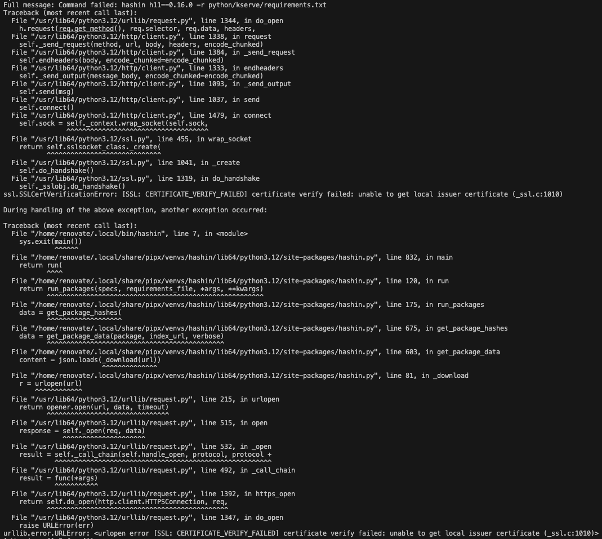

# Renovate Log Analyzer (used as part of the [MintMaker](https://github.com/konflux-ci/mintmaker) service)

This repository contains a Go implementation for analyzing Renovate logs and extracting categorized errors, warnings, and info messages. The implementation provides both level-based error (and fatal) extraction and message-based pattern matching for Renovate logs.

Another part of this repo is the Kite client, which takes the information after analyzing the logs and sends it to [Kite API](https://github.com/konflux-ci/kite) to be displayed on an Issue dashboard in Konflux UI.

This service is meant to run as last step of `tekton pipeline` created by the [MintMaker controller](https://github.com/konflux-ci/mintmaker).

## Log analyzer

- **`checks.go`**: Check definitions with selector registration for message-based pattern matching
- **`models.go`**: Data models (`LogEntry` and `SimpleReport`)
- **`report.go`**: Simple report functionality for collecting categorized messages
- **`log_reader.go`**: Log processing logic for extracting logs from a `json` file and parsing them into `Go` object

## Architecture

### Dual Processing Approach

The implementation provides two complementary approaches for log analysis:

1. **Level-based extraction**: Extracts ERROR and FATAL messages based on log level for `FailureLogs`
2. **Message-based extraction**: Uses pattern matching to categorize messages into errors, warnings, and info

### Selector Pattern - main logic taken from [mintmaker-e2e logdoc checks](https://gitlab.cee.redhat.com/rsaar/mintmaker-e2e/-/tree/main/tools?ref_type=heads)

The message-based approach uses selector pattern matching:

```go
// Register a selector at initialization
func init() {
    registerSelector("Base branch does not exist - skipping", baseBranchDoesNotExist)
}

// Check function
func baseBranchDoesNotExist(line *LogEntry, report *SimpleReport) {
    report.Error("Base branch does not exist", 
        "Hint", "Check `baseBranchPatterns` in renovate.json")
}
```

### Simple Report System

The implementation uses a simple report system:

```go
type SimpleReport struct {
    Errors   []string
    Warnings []string
    Infos    []string
}

func (r *SimpleReport) Error(msg string, fields ...interface{}) {
    // Format and add to Errors slice
}
```

## Selector List

All selectors from the [mintmaker-e2e logdoc checks](https://gitlab.cee.redhat.com/rsaar/mintmaker-e2e/-/tree/main/tools?ref_type=heads) are implemented with some changes:

1. `"Reached PR limit - skipping PR creation"` - Warning
2. `"Base branch does not exist - skipping"` - Error
3. `"Config migration necessary"` - Warning
4. `"Config needs migrating"` - Warning
5. `"Found renovate config errors"` - Error
6. `"branches info extended"` - Info
7. `"PR rebase requested=true"` - Info
8. `"rawExec err"` - Error
9. `"Ignoring upgrade collision"` - Warning
10. `"Platform-native commit: unknown error"` - Error
11. `"File contents are invalid JSONC but parse using JSON5"` - Error
12. `"Repository has changed during renovation - aborting"` - Error
13. `"Passing repository-changed error up"` - Error

## Log Levels

Following [Renovate documentation](https://docs.renovatebot.com/troubleshooting/):

- **TRACE**: 10
- **DEBUG**: 20
- **INFO**: 30
- **WARN**: 40
- **ERROR**: 50
- **FATAL**: 60

## extractUsefulError Function

The `extractUsefulError` function intelligently extracts the most useful parts of potentially long error messages. It's designed to reduce noise while preserving critical information and context.

### How It Works

1. **Preserves the first line**: Always keeps the initial error message for context
2. **Identifies critical lines**: Uses regex patterns to detect important error lines (e.g., "Command failed:", "Error:", "FATAL:", "Caused by:", etc.)
3. **Maintains context**: Keeps a rolling buffer of recent non-critical lines for context
4. **Preserves the end**: Always includes the last few lines of the error message
5. **Filters noise**: Skips empty lines and lines containing only symbols (like `~`, `^`, `=`)
6. **Limits output**: Restricts output to a maximum number of lines (default: 8) to keep messages concise (it can be a little bit more, because of the last 3 lines being added after the max length check)

### Example

The function transforms verbose error messages into concise, actionable summaries. The images below demonstrate the transformation:

**Before** - Full verbose error message with many lines of stack traces and context:



**After** - Same error after processing with `ExtractUsefulError`, highlighting only the critical parts:


The function is used automatically in the `rawExecError` check function to provide cleaner, more readable error messages in reports.

## Kite client
- **`client.go`**: Contains everything needed to communicate with the [Kite API backend](https://github.com/konflux-ci/kite/tree/main/packages/backend) - defines Payload structures, initializes the client and contains functions to send requests. The client checks Kite API health status and sends webhooks for pipeline success or failure.

## Local Testing

### Command Line Flags

- **`-dev`**: Enable development mode with more verbose logging and source location (default: false)

To test the log analyzer locally using `go run ./cmd/log-analyzer/main.go` the following set up is needed:

### Required Environment Variables

The application requires the following environment variables:

- **`NAMESPACE`**: Kubernetes namespace (required)
- **`KITE_API_URL`**: URL to the Kite API endpoint (required)
- **`GIT_HOST`**: Git host (e.g., github.com) (optional)
- **`REPOSITORY`**: Repository name (optional)
- **`BRANCH`**: Branch name (optional)
- **`LOG_FILE`**: Path to the Renovate log file (optional, defaults to `/workspace/shared-data/renovate-logs.json`)
- **`PIPELINE_RUN`**: Pipeline run identifier (optional, defaults to "unknown")

### Test Log File Format

The log file should contain Renovate JSON logs, with each line being a separate JSON object. Example:

```json
{"level": 20, "msg": "rawExec err", "err": {"message": "Command failed: npm install"}, "branch": "main"}
{"level": 40, "msg": "Reached PR limit - skipping PR creation"}
{"level": 30, "msg": "branches info extended", "branchesInformation": [...]}
{"level": 50, "msg": "Base branch does not exist - skipping", "baseBranch": "feature/old"}
{"level": 60, "msg": "Fatal error occurred", "err": {"message": "Critical failure"}}
```

### Example Test Command

```bash
# Set required environment variables
export NAMESPACE=namespace-name
export KITE_API_URL=https://kite-api.example.com            # or placeholder for testing
export GIT_HOST=github.com
export REPOSITORY=owner/repo
export BRANCH=main
export LOG_FILE="./pkg/doctor/testdata/fatal_exit_logs.json" # path to test log file (or /test_logs.json for testing the string-based caategorization)
export PIPELINE_RUN=test-run-123                            # optional

# Run the application
go run ./cmd/log-analyzer/main.go --dev
```

### How It Works

1. **Log Processing**: The application reads the log file and extracts ERROR (level 50) and FATAL (level 60) entries. 

2. **Error Aggregation**: Level based errors are aggregated by message, with duplicate counts tracked.

3. **Check against selectors**: Checks againts the integrated Selectors are performed for each parsed log entry. Only the interesting log messages (with additional information extracted from logs) are kept in categorised groups (Errors, Warnings, Infos).

3. **Kite API Health Check**: Before sending webhooks, the application checks the Kite API health status.

4. **Webhook Notification**:
   - If no errors are found, sends a `pipeline-success` webhook
   - If errors are found, sends a `pipeline-failure` webhook with the aggregated failure reason
   - If errors, warnings or infos are present in the generated report, send the corresponding custom `mintmaker-custom` webhook request.

5. **Pipeline Identifier**: The pipeline identifier is constructed as `{GIT_HOST}/{REPOSITORY}@{BRANCH}`.

### Notes

- **Kite API URL**: For testing log parsing only, the Kite API URL does not need to be a working endpoint. The service will parse the JSON logs from the file and display results via logs, but webhook sending will fail if the API is not accessible.
- **Log file location**: Ensure the log file path is correct and the file is readable. If `LOG_FILE` is not set, it defaults to `/workspace/shared-data/renovate-logs.json`.
- **Error handling**: The application exits with code 1 if any step fails (missing environment variables, log processing errors, API failures, etc.)